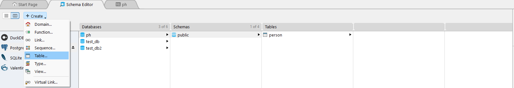

# PostgreSQL-Essentials

## 7-1 Solving The First Case Study

### Case Study Example

A Medical Database System is needed to enhance the efficiency and effectiveness of healthcare services. This system will be able to seamlessly integrates the information of patients, doctors, appointments, medical records, and medical facilities.

**Entities:**

1. **Patients:**
   - Attributes: PatientID (Primary Key), FirstName, LastName, DateOfBirth, Gender, ContactNumber, Email
2. **Doctors:**
   - Attributes: DoctorID (Primary Key), FirstName, LastName, Specialization, ContactNumber, Email
3. **Appointments:**
   - Attributes: AppointmentID (Primary Key), PatientID (Foreign Key), DoctorID (Foreign Key), AppointmentDate, AppointmentTime, Status
4. **Medical Records:**
   - Attributes: RecordID (Primary Key), AppointmentID (Foreign Key), Diagnosis, Prescription, TestResults, createdAt
5. **Medical Facilities:**
   - Attributes: FacilityID (Primary Key), FacilityName, Location, ContactNumber

**Relationships:**

- Patients can have multiple appointments with different doctors.
- Doctors can have multiple appointments with different patients.
- Each appointment may have a corresponding medical record, and vice versa.
- A medical facility can have multiple doctors, and a doctor can work in multiple medical facilities.
- This relationship is represented through a junction table.


## 7-2 Exploring PSQL and Its Default Behavior

- we can run PSQL in our windows terminal as well.
- open the powershell in administrator mode.
- If the powershell do not run the psql command then we have to set the environment variable.


- `psql -U postgres` use this command to set the psql user. here we are not giving the database name and this will take us to the postgres named user names database postgres by default.


- We will not use the postgres database as it is admin type database. so we will use different created database.


- Here the templates re the blue print of the database that we are going to create. In the templates there is already added what functionalities a database will have and what will be the constrains and how the features of a database is implemented all are built in the templates. using the templates the regular database are created. Here template0 is used to create template1. We will use template1 to create the database. and the template0 is given for backup. postgres database is also made on the template1. If we make any changes in the template1 All the database made will get the change.

- `\c template1` lets move to the template1


- `create database test_db;` - this will create a database using the template1. as the template1 is used in another terminal there will be error


- Switch to postgres


- `create database test_db;` will now create a database.


- While creating the database we can tell all the things that are by default to modify them while creating.

```ts
  CREATE DATABASE name
[ WITH ] [ OWNER [=] user_name ]
       [ TEMPLATE [=] template ]
       [ ENCODING [=] encoding ]
       [ STRATEGY [=] strategy ]
       [ LOCALE [=] locale ]
       [ LC_COLLATE [=] lc_collate ]
       [ LC_CTYPE [=] lc_ctype ]
       [ BUILTIN_LOCALE [=] builtin_locale ]
       [ ICU_LOCALE [=] icu_locale ]
       [ ICU_RULES [=] icu_rules ]
       [ LOCALE_PROVIDER [=] locale_provider ]
       [ COLLATION_VERSION = collation_version ]
       [ TABLESPACE [=] tablespace_name ]
       [ ALLOW_CONNECTIONS [=] allowconn ]
       [ CONNECTION LIMIT [=] connlimit ] // at a time how many users
       [ IS_TEMPLATE [=] istemplate ]
       [ OID [=] oid ]

```

- this is not that necessary but we can do. `create database test_db2 with template template0;` we have used this to change the database template. `[ CONNECTION LIMIT [=] connlimit ]` this field is for limiting the users.
- `psql -U postgres -d test_db` This will take us to the test_db database

## 7-3 User, Role And Privilege Management In Postgres

### Schema

- lets understand the database schema. When we create a database a public schema is created b y default. If we want we can make other schema under the public schema. under the schema we can create the tables. `/dn` will show the available schema of the database.


- basically we will do all the works in public schema.
- Schema is like a box. A database might have multiple table. the tables are separated in schema box. suppose we have a table named employee under public employee. if we want to access we will say `public.employee`, here is public is schema name. and if we do not give any schema name it will grab the public schema by default.

### User Management in Postgres

- `\du` this will show the users of the database


- Here are some attributes which are some privilege collection. the privileges are like we are giving permission for doing something. A user can update, delete, insert anything or not those are called privilege. some privilege all together makes attributes. we always skip the super user and make it like small work access to a user. since if anyone gets the access of the postgres access he will ruin our database as the postgres is super user.

- `create user user1` this will create a user.
- `create user user1 with login encrypted password '123456';` this will create a user who will have login attribute and will have a encrypted password .


- `create role role1 with login encrypted password '123456';` this will create a role same like user.


- We can login the created user using the created one in psql


- If we use powershell we have to write `psql -U user1 -U postgres` this is equivalent to `psql -U postgres`
- `psql -U user1 -d postgres`


- as there is no table lets make a table using `create table test_table(name varchar(50));`


- using `\d` we can see the tables
- lets insert a data to the table using `insert into test_table(name) values('Sazid');`
- if we ant to see everything inside the table `select * from test_table;`


## 7-4 Granting and Revoking Privileges


- here we are as user who have no permission given. thats why we can not select all the columns of table using `select * from test_table;`.
- now we want to give permission to the user1 from where we have logged in as postgres super user.
- `grant all privileges on test_table to user1;` this will give the user1 all the access of doing read write and all.


- now from where we are logged in we are getting the access of the table.

- `insert into test_table(name) values('Shakil');` we can insert as well by using User1.


- now make a user who will not get all the access. he just can see the data. `create user user2 with encrypted password '123456';`

- open another tab and access using user2


- from the main postgres logged in terminal `grant select on test_table to user2` using this will allow the user2 to just select and show.


- From here we can see the table but can not insert as we have not gave te access to write.
- we can take back the permission as well using `revoke select on test_table from user2;`.


- `grant all privileges on all tables in schema public to user2;` this command will give all the access of the all the tables of the public schema to user2. u7ser2 can insert update delete on public schema.
- we can create role can act as user or a role can be given as privilege/attribute to a user.
- `grant select on all tables in schema public to role1;` we are giving selecting permission for all tables of public schema to role1

- `create user user3 with encrypted password '123456';` now creating a user and give the privileges of role1.


- `grant role1 to user3;` this will give the role1 access to the user3. and now on user3 can access all the tables of the public schema.


- now user3 can access the tables but can not insert in the table


- this is supposed to happen.
- we can use a user as the privilege/attribute of another user

## 7-5 Structured Query Language(SQL)

#### What is Structured Query Language(SQL)?

- It is a query language by using this we can do queries. This is specific domain language. By using this language we do communication with database. this is also called `sequel` at the early stage and the full form was standard english query language then the name is changed to sql. this do the query in database, this can grab data can post data, can update data, can delete data and manipulate data. This is a standardized language which works on relational database model. here query means a sql statement.

- `SELECT * FROM test_table` this sis sql statement `SELECT` `FROM` is a sql keyword, `test_table` is a identifier.

- SQL is a declarative language. There are some language that are imperative.
- In declarative language we just have to say what to do. and we do not need to tell how to do.(sql)
- In imperative language we have to tell everything step by step. (java). python is hybrid of imperative and declarative.


#### SQL Commands Are divided into different categories.


- **DDL** - Database Definition Language. Used to define and manage database structure(tables, schemas, etc). Think of DDL as "building or breaking the structure of your house".

| Command    | Description                     | Example                                   |
| ---------- | ------------------------------- | ----------------------------------------- |
| `CREATE`   | Creates a new table or database | `CREATE TABLE users (id INT, name TEXT);` |
| `DROP`     | Deletes a table or database     | `DROP TABLE users;`                       |
| `ALTER`    | Modifies an existing table      | `ALTER TABLE users ADD email TEXT;`       |
| `TRUNCATE` | Deletes all data in a table     | `TRUNCATE TABLE users;`                   |

- **DML** - Database Manipulation/Modification Language. Used for modifying data inside existing tables. DML is like cleaning or changing the items inside your house.

| Command  | Description            | Example                                        |
| -------- | ---------------------- | ---------------------------------------------- |
| `INSERT` | Adds new data          | `INSERT INTO users (name) VALUES ('Ali');`     |
| `UPDATE` | Modifies existing data | `UPDATE users SET name = 'Ayan' WHERE id = 1;` |
| `DELETE` | Removes data           | `DELETE FROM users WHERE id = 1;`              |

- **DCL** - Database Control Language for controlling user access. Used for access control — who can see or modify what. DCL is like giving or taking back keys to your house.

| Command  | Description                  | Example                                       |
| -------- | ---------------------------- | --------------------------------------------- |
| `GRANT`  | Gives user access privileges | `GRANT SELECT ON users TO read_only_user;`    |
| `REVOKE` | Removes access privileges    | `REVOKE SELECT ON users FROM read_only_user;` |

- **TCL** - Transaction Control Language. Used to control transactions, especially in cases where multiple steps must succeed together.TCL is like Undo/Redo for your data changes.

| Command     | Description                                   | Example               |
| ----------- | --------------------------------------------- | --------------------- |
| `COMMIT`    | Saves all changes made during the transaction | `COMMIT;`             |
| `ROLLBACK`  | Undoes changes if something goes wrong        | `ROLLBACK;`           |
| `SAVEPOINT` | Sets a point to roll back to later            | `SAVEPOINT my_point;` |

- DQL - Data Query Language. Used to fetch data from the database. DQL is like asking questions: "Hey DB, show me this!"

| Command  | Description                 | Example                |
| -------- | --------------------------- | ---------------------- |
| `SELECT` | Retrieves data from a table | `SELECT * FROM users;` |


- sql will be written in backend. sql can be written in raw or we can use orm.
- SQL is a standardized query language and postgres is made based on SQL which is implementation Of SQL. While implementing it changes slightly.

## 7-6 Exploring PGAdmin and Valentina Studio

- PGAdmin Is a Graphical Interface By which we can we can run sql commands here as well. We can be compared as MongoDB Compass.


- Write the query using this tool as well


- Inside the database we have schema and under the schema we have public schema.under the public schema tables are created.


- sql query will return data in table format.

- The privileges and the users will be found here.


- we can gr4ant or revoke a privilege from here like we have done in command line. when we will work in virtual private server like EC2 of aws or droplet of digital ocean we will use terminal since there will be only terminal access.

- we will not use PGAdmin, we will use DataGrib here we will be able to connect mysql and other database. another one is DBeavar, TablePlus.

- We wil use `valentian Studio` as its a cors platform we can use it in mac windows linux and it is easy to use. we can use multiple database like postgres,oracle, mysql and etc.


- by default postgres database will not show here. If We Want We Can Connect


- after this we will get the postgres database


- If we press `ctrl+e` or press the execute button we will see the table available


- It will show the errors


- we can create database from here as well.

## 7-7 Create, Update and Delete Database and Data Types In Postgres.

- use powershell `psql -U postgres -d postgres` Use This Command To connect in postgres user and postgres database.
- `create database test;` this will create a database
- If we want to change the database name `alter database test rename to ph;`


- By Using alter we can change the database name and as well as table or other names
- If We want to delete the database we just have to say `drop database ph;`


#### Now Lets Create a table in the database.

##### Data Types

- While we create a table in a column what type of data will be there we have to tell.
- In Each Column we have to keep fixed type of data. The reason behind to make the type fixed
  1. **Data Consistency** : While Creating Column we will tell the data type so that different type data is not assignable.
  2. **Performance** : Query Performance will be increase if we use proper data types
  3. **Constrain Enforcement** : Its kind of validation
  4. **Convenience and Functionality** : Like if we put date type of data we will get some facilities to work over date.
  5. **Storage Efficiency** : We can define which column will take how much space.


#### Data Type in Postgres

1. Boolean
2. Number
3. Binary
4. Date/Time
5. Json
6. Character
7. UUID
8. Array
9. XML

- rather than these there are many more data types of postgres.
- Mostly used data types are
  1. Boolean
  2. Numbers
  3. Date/Time
  4. Character
  5. UUID

#### Boolean Data Type

- a boolean can be `true`,`false` or `null`. Null is also called boolean here in postgres
- There is a fact like type casting `T` will be true , `No` it will make it false, `yes` it will be converted to true.

#### Number Data Type

##### Integers


1. `INT`

- **Range:** - 2,147,483,648 to 2,147,483,647
- **Storage:** 4 bytes
- **Usage:** Commonly used for standard integer values.The INT data type is used for integer values within the standard range

2. `BIGINT`

- **Range:** - 9,223,372,036,854,775,808 to 9,223,372,036,854,775,807
- **Storage:** 8 bytes
- **Usage:** Suitable for storing very large integer values. BIGINIT provides larger range than INT and is suitable for storing very large integer values

3. `SMALLINT`

- **Range:** - 32,768 to 32,767
- **Storage:** 2 bytes
- **Usage:** Ideal for small integer values with limited range. SmallINT is suitable for storing small integer values within a more limited range.

##### Floating Point Numbers

4. `FLOAT4` (Single Precision)

- **Storage:** 4 bytes
- **Precision:** Up to 6 digits Precision

5. `FLOAT8` (Double Precision)

- **Storage:** 8 bytes
- **Precision:** Up to 15 digits Precision

##### Exact Numeric

6. `NUMERIC(precision, scale)`

- **Range:** Unlimited
- **Storage:** Variable (based on precision & scale)
- **Example:** `NUMERIC(4,3)` — 4 digit before decimal, 3 after digit

##### Serial Type

7. `SERIAL`

- **Range:** Like `INT`
- **Behavior:** Auto-incrementing integer (used for primary keys). there will be no decrement

#### Character Data Type


##### `CHAR`

- `CHAR` is a **fixed-length** character type.
- **Storage:** The length is fixed and specified when defining the column.
- If the actual string is shorter than the specified length, it is padded with spaces.
- **Example:** `CHAR(10)` means a fixed-length string of 10 characters.

##### `VARCHAR`

- `VARCHAR` is a **variable-length** character type.
- **Storage:** The length is not fixed and can vary up to the specified maximum length.
- No padding with spaces is done, making it more storage-efficient when dealing with variable-length strings.
- **Example:** `VARCHAR(255)` means a variable-length string with a maximum length of 255 characters.

##### `TEXT`

- `TEXT` is also a **variable-length** character type.
- **Storage:** Similar to `VARCHAR`, it is not fixed in length.
- Typically used for longer text strings where the exact length is not known or can vary widely.
- **Example:** `TEXT` is often used for columns containing large amounts of text.

#### Date Type


- Postgres supports date type of all kind of date.

#### UUID Type


- Instead Of Serial we can use this uuid for making primary key. Thi sis generated auto.

## 7-8 Creating a table with multiple Columns And Different Data Types


- lets open the sql editor

- `CREATE DATABASE ph;` will create a database named ph
  

##### Table Creating Format


- by using constrain we can make it more strict like it should more unique in each row and can not be null. and the constrain is optional

```sql
-- create database ph;

-- Creating a table

CREATE TABLE person(
person_id SERIAL,
first_name VARCHAR(50),
last_name VARCHAR(50),
age INTEGER,
is_active BOOLEAN,
dob DATE
)
```

- after creating the table we will see the table


- by clicking the fields wer can do more functionalities. like we can set the constrains in the flag.


- selecting from the tables section we can also edit the table


- we can change data type
- we can add row column
- we can set the constrains
- we can do indexing



- by clicking the desired place or segment we can add what we want


- we can do all using GUI but for learning we will use sql query.

##### Lets rename the table

- as user is a reserved key of sql so nwe gave gave it inside a string

```sql
ALTER TABLE person RENAME TO "user";
```

##### Lets drop the table

```sql
DROP TABLE "user";
```

## 7-9 Creating A Table With Multiple Columns and Column Constrain

#### What is Constrain?

- Beside the columns we have gave type restriction why do I need constrains?
- Data type give sone level validation
- Extra level of restriction is given by constrains.pne column might have multiple constrains
- The constrain is like setting rules and the rules should be maintained.


- giving nothing means null . suppose we have product table so, here all product should have price it can not be null. if it becomes null it will be venerable.
- There are some values we do not want to see null, in this case we will use constrain.


- In case of email the emails should be made unique.


- To Become a primary key a value can not be null and it should be unique.
- If unique we can make a primary key and the field should never be null


- In here customer id is foreign key and it is referencing from the costumer table primary key customer_id. and it must have to be customer_id


- we can set the default values.


- using check we can give custom validation.

#### Those are column constrain these implies only on some certain columns.


```sql
CREATE TABLE person2 (
id serial PRIMARY KEY,
user_name VARCHAR(20) NOT NULL,
age INTEGER CHECK(age>=18)
)
```


- by clicking the design we can see the structures that we have gave to the table.

## 7-10 Different Methods To Define Constrains

```sql
CREATE TABLE person2 (
id serial PRIMARY KEY,
user_name VARCHAR(20) NOT NULL,
age INTEGER CHECK(age>=18)
)
```

- we can define the primary key in different way

```sql
CREATE TABLE person2 (
id serial ,
user_name VARCHAR(20) NOT NULL,
age INTEGER CHECK(age>=18),
PRIMARY KEY(id)
)
```

- to add multiple constrain we have to follow this
- when we make unique by default it does the indexing as well to the column for faster query.
- If we use primary Key constrain it also makes indexing since here primary key is unique.

```sql
CREATE TABLE person2 (
id serial ,
user_name VARCHAR(20) NOT NULL UNIQUE,
age INTEGER CHECK(age>=18),
PRIMARY KEY(id)
)
```

- when multiple key is required suing primary key() will be an option

```sql
CREATE TABLE person4 (
  id serial,
  user_name VARCHAR(20) NOT NULL,
  age INTEGER CHECK(age >= 18),
  PRIMARY KEY(id,user_name),
  UNIQUE(user_name, age)
);
```

- as like primary nkey we can also say unique constrain. here `UNIQUE(user_name,age)` is meaning something like combination of user_name,age can not be same. Like in first row Say User_Name : John, age:45, in the entire table this combination can not repeat.


## 7-11 Inserting Data Into a Table And Checking Constrains

- We have made constrains now we are going to check.

### Inserting data insert inside a table

1. Single Row Insert


```sql
INSERT INTO person2(id,user_name,age) VALUES(1,'sazid', 26);
```

2. Multiple Row Insert


```sql
INSERT INTO person2(id,user_name,age) VALUES(3,'lisa', 28), (4,'shakil', 29);
```

3. Alternative method. here we do not specify the columns this the drawback since if new column added this will cause problem.


```sql
INSERT INTO person2 VALUES(5,'Mir', 28), (6,'Pir', 29);
```

- check constrain

```sql
INSERT INTO person2 VALUES(7,'Firoza', 14);

-- ERROR:  new row for relation "person2" violates check constraint "person2_age_check"
```


### practice 

```sql
CREATE TABLE patient (
patient_id serial PRIMARY KEY,
first_name VARCHAR(20) NOT NULL,
last_name VARCHAR(20) NOT NULL,
dob Date NOT NULL
)

CREATE TABLE doctor (
doctor_id serial,
first_name VARCHAR(20) NOT NULL,
last_name VARCHAR(20) NOT NULL,
specialization TEXT NOT NULL,
contact_number VARCHAR(20) NOT NULL,
email VARCHAR(20) NOT NULL UNIQUE,
PRIMARY KEY(doctor_id)
)

CREATE TABLE appointment (
  appointment_id SERIAL PRIMARY KEY,
  patient_id INTEGER NOT NULL REFERENCES patient(patient_id) ON DELETE CASCADE,
  doctor_id INTEGER NOT NULL REFERENCES doctor(doctor_id) ON DELETE CASCADE,
  appointment_date DATE NOT NULL,
  appointment_time TIME NOT NULL,
  status BOOLEAN NOT NULL DEFAULT FALSE,
  UNIQUE (doctor_id, appointment_date, appointment_time)
);

INSERT INTO patient (first_name, last_name, dob)
VALUES 
  ('Sazid', 'Khan', '1998-06-15'),
  ('Fatima', 'Rahman', '2000-01-25'),
  ('Aamir', 'Ali', '1995-09-10');


ALTER TABLE doctor ALTER COLUMN email TYPE VARCHAR(90);

INSERT INTO doctor (first_name, last_name, specialization, contact_number, email)
VALUES 
  ('Dr. Sarah', 'Malik', 'Cardiology', '1234567890', 'sarah.malik@hospital.com'),
  ('Dr. Ahmed', 'Khan', 'Dermatology', '0987654321', 'ahmed.khan@hospital.com'),
  ('Dr. Anjali', 'Mehta', 'Pediatrics', '1122334455', 'anjali.mehta@hospital.com');

INSERT INTO appointment (patient_id, doctor_id, appointment_date, appointment_time, status)
VALUES 
  (1, 1, '2025-05-20', '10:00:00', FALSE),
  (2, 2, '2025-05-21', '11:30:00', TRUE),
  (3, 3, '2025-05-22', '09:15:00', FALSE),
  (1, 2, '2025-05-23', '14:00:00', FALSE);

```