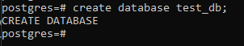

# PostgreSQL-Essentials

## 7-1 Solving The First Case Study

### Case Study Example

A Medical Database System is needed to enhance the efficiency and effectiveness of healthcare services. This system will be able to seamlessly integrates the information of patients, doctors, appointments, medical records, and medical facilities.

**Entities:**

1. **Patients:**
   - Attributes: PatientID (Primary Key), FirstName, LastName, DateOfBirth, Gender, ContactNumber, Email
2. **Doctors:**
   - Attributes: DoctorID (Primary Key), FirstName, LastName, Specialization, ContactNumber, Email
3. **Appointments:**
   - Attributes: AppointmentID (Primary Key), PatientID (Foreign Key), DoctorID (Foreign Key), AppointmentDate, AppointmentTime, Status
4. **Medical Records:**
   - Attributes: RecordID (Primary Key), AppointmentID (Foreign Key), Diagnosis, Prescription, TestResults, createdAt
5. **Medical Facilities:**
   - Attributes: FacilityID (Primary Key), FacilityName, Location, ContactNumber

**Relationships:**

- Patients can have multiple appointments with different doctors.
- Doctors can have multiple appointments with different patients.
- Each appointment may have a corresponding medical record, and vice versa.
- A medical facility can have multiple doctors, and a doctor can work in multiple medical facilities.
- This relationship is represented through a junction table.

## 7-2 Exploring PSQL and Its Default Behavior

- we can run PSQL in our windows terminal as well.
- open the powershell in administrator mode.
- If the powershell do not run the psql command then we have to set the environment variable.

- `psql -U postgres` use this command to set the psql user. here we are not giving the database name and this will take us to the postgres named user names database postgres by default.

- We will not use the postgres database as it is admin type database. so we will use different created database.

- Here the templates re the blue print of the database that we are going to create. In the templates there is already added what functionalities a database will have and what will be the constrains and how the features of a database is implemented all are built in the templates. using the templates the regular database are created. Here `template0` is used to create `template1`. We will use `template1` to create the database. and the `template0` is given for backup. `postgres` database is also made on the `template1`. If we make any changes in the `template1` All the database made will get the change.

- `\c template1` lets move to the template1

- `create database test_db;` - this will create a database using the template1. as the template1 is used in another terminal there will be error

- Switch to `postgres`

- `create database test_db;` will now create a database.

- While creating the database we can tell all the things that are by default to modify them while creating.
  `CREATE DATABASE name
[ WITH ] [ OWNER [=] user_name ]
       [ TEMPLATE [=] template ]
       [ ENCODING [=] encoding ]
       [ STRATEGY [=] strategy ]
       [ LOCALE [=] locale ]
       [ LC_COLLATE [=] lc_collate ]
       [ LC_CTYPE [=] lc_ctype ]
       [ BUILTIN_LOCALE [=] builtin_locale ]
       [ ICU_LOCALE [=] icu_locale ]
       [ ICU_RULES [=] icu_rules ]
       [ LOCALE_PROVIDER [=] locale_provider ]
       [ COLLATION_VERSION = collation_version ]
       [ TABLESPACE [=] tablespace_name ]
       [ ALLOW_CONNECTIONS [=] allowconn ]
       [ CONNECTION LIMIT [=] connlimit ] // at a time how many users
       [ IS_TEMPLATE [=] istemplate ]
       [ OID [=] oid ]`
- this is not that necessary but we can do. `create database test_db2 with template template0;` we have used this to change the database template. `[ CONNECTION LIMIT [=] connlimit ]` this field is for limiting the users.
- `psql -U postgres -d test_db` This will take us to the test_db database
